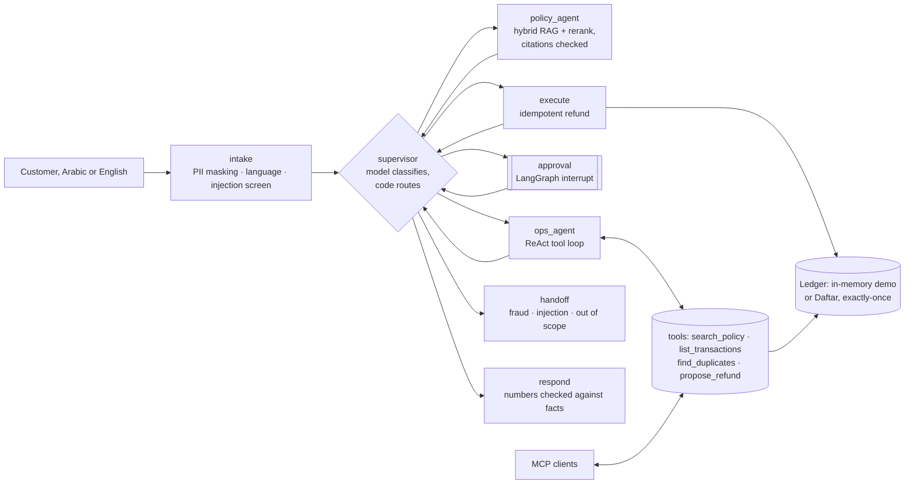

# Wakeel · وكيل

**A card-dispute agent for a Saudi bank**, built the way a regulated client would need it:
- **Workflow:** LangGraph orchestration with a supervisor and two specialist agents.
- **Knowledge:** hybrid RAG over the bank's policies in Arabic and English.
- **Tools:** tool calling against a real double-entry ledger.
- **Control:** a human approves every refund.
- **Safety:** PII masking, prompt-injection defences.
- **Proof:** an evaluation suite that fails the build on any unsafe outcome.
- **Interoperability:** the same tools exposed over MCP.

> Sahm Bank, its customers and its policies are **fictional**. No real money moves.

```
customer: "I was charged twice at Jarir Bookstore, card 4111 1111 1111 1111"
  intake        masks the card → [card ••1111], language en, injection screen clear
  supervisor    intent = duplicate_charge
  policy_agent  hybrid search → disputes#3 "Duplicate charges", cited
  ops_agent     find_duplicates → tx_1001 (original), tx_1002 (duplicate)
                propose_refund(tx_1002, 349.00 SAR, disputes#3)   ← proposal only
  approval      ⏸ interrupt: a bank employee approves
  execute       refund with idempotency key wakeel:<case>:tx_1002
  respond       "Your refund of 349.00 SAR … within 3 working days [disputes#3]"
```

## Architecture

The exact graph, generated from the compiled code: [docs/graph.md](docs/graph.md).



| Concern | How Wakeel handles it |
|---|---|
| **Orchestration** | A LangGraph `StateGraph` with a checkpointer. The model classifies the request, but **code decides the order of steps**, so approval can never be skipped. A human approval is a LangGraph `interrupt`, resumed with `Command(resume=…)`. |
| **Clarifying questions** | When a request is ambiguous ("I was charged twice" with two qualifying merchants), the agent asks the customer once, through a second LangGraph interrupt, instead of guessing. The answer is masked like any message, and the operations agent runs again with it. |
| **Multi-agent** | Supervisor pattern: a policy agent (retrieval and grounded answers) and an operations agent (tools). Each worker returns to the supervisor. |
| **Query rewriting** | With a model, colloquial or dialect questions are rewritten into up to two queries in the policy's vocabulary, each is searched, and the results are fused. Example: "الفلوس انسحبت مني مرتين" alone ranks the duplicate-charge section 13th; the rewritten query ranks it 1st. |
| **RAG** | **Chunking:** heading-aware, with stable section ids for citations. **Search:** BM25 (Arabic-normalised: diacritics, alef forms, taa marbuta, the definite article) plus dense vectors (Gemini embeddings, or an offline n-gram hasher), fused with reciprocal rank fusion. **Reranking:** by the model, falling back to the fused order. |
| **Output guard** | The final reply is scanned: any personal data (card, ID, IBAN, phone) or echo of the system prompt and the reply is replaced by the template. |
| **Hallucination control** | **Citations:** any section id that wasn't retrieved is dropped. **Numbers:** every number in the final reply must appear in the facts, otherwise a template is used. **Calculations:** done in code, never by the model (duplicates, the 60-day window, caps, refundable amounts). |
| **Tool safety** | **Customer:** fixed by the session; no tool takes a customer id. **Refunds:** the agent can only *propose* one. **Rules:** caps and windows are enforced in code. **Execution:** refunds carry an idempotency key, so retries and double clicks never pay twice. |
| **Concurrency** | Ten reviewers approving the same case at once pay once, and every one sees the final state (a per-case lock, with the ledger's idempotency key as the backstop across servers). Fifty customers filing about the same duplicate at once lead to exactly one refund. Both tested. |
| **Semantic cache** | Policy-only answers are reused when a new question means the same as a recent one (cosine similarity, same language), with no model call. The cache is keyed to a hash of the policy corpus, so editing a policy empties it. Account-specific cases never touch it. |
| **Cost control** | At most 8 tool steps and a per-case token budget; past it, the loop stops and rules finish the case (tested with a model that never stops). 10 cases a minute per address. |
| **Prompt injection** | **Screen:** a pattern screen (English and Arabic) sends suspicious messages to a person. **Structure:** even a fully hijacked model cannot reach another customer or move money (a test plays exactly that). |
| **Injection classifier** | With a Groq key, Meta's Llama Prompt Guard 2 scores each (masked) message as a second screen beside the patterns. Measured on the 12 attacks: patterns caught 8, the classifier 3 (most attacks here are business manipulation in plain language, not jailbreak text), and neither flagged any of 16 genuine messages. The structural defences stopped all 12. A classifier is one layer, not the defence. |
| **PII / PDPL** | Card numbers (Luhn-checked; the last four kept), Saudi ID and Iqama numbers, IBANs, phone numbers and emails are masked **before** any model or log sees them. Only the masked text is stored. |
| **Models** | One interface, with adapters for Gemini, Groq (OpenAI-compatible, so OpenAI too) and Claude, in plain HTTP. **Fallback:** rate limits and outages move to the next provider; a bad request does not. **Degradation:** if every provider is down, each node falls back to deterministic rules and cases still progress. |
| **Free model chain** | With a Gemini key and a Groq key, Wakeel uses 7 free models in order. Each has its own quota, so the chain falls back across them before reaching rules. ALLaM is SDAIA's Arabic model; being chat-only, it is skipped for tool steps and used for text. `WAKEEL_MODELS` sets any order, and Cerebras, OpenRouter, Mistral and GitHub Models plug in with their keys. |
| **Observability** | Every step records its node, latency, provider, model, tokens, tool calls, retrieved and cited ids, and fallbacks. The demo page shows the trace for each case. **OpenTelemetry:** with `OTEL_EXPORTER_OTLP_ENDPOINT` set, every case is exported as a trace (one span per step, with `gen_ai.*` attributes from the GenAI semantic conventions) to Langfuse, Grafana, Jaeger or Datadog, carrying ids and masked text only. |
| **Durable state** | **Checkpoints:** LangGraph checkpoints in SQLite, so a case awaiting approval survives a restart and a new process can resume it (tested). **Index:** a case index feeds the reviewer queue (`GET /api/cases?status=awaiting_approval`). |
| **Audit trail** | Every opening, proposal, decision and refund is written to an append-only, hash-chained log (database triggers block edits). `GET /api/audit/verify` recomputes the chain and names the first broken entry; a test edits one and catches it. |
| **Streaming** | `POST /api/cases/stream` sends each graph step as a server-sent event as it finishes, so the page shows the agent working live. |
| **Metrics** | `GET /metrics` serves Prometheus metrics: cases by status and intent, human decisions, model calls and tokens by provider, provider fallbacks, tool calls and errors, and time per node. |
| **MCP** | `python -m wakeel.mcp_server` serves the same four tools over stdio to any MCP client, with the same guarantees. |
| **Deploy** | **Docker:** non-root image. **Kubernetes:** probes, an HPA and Secrets. **Render:** a free blueprint. **CI:** tests, evaluations, a container smoke test and an image push. |

## Results

Offline, as run in CI (rules mode, no model). Run `python -m evals.run`.

**Retrieval** (30 questions, 20 English and 10 Arabic; gold = the policy section that answers it):

| | recall@1 | recall@3 | MRR |
|---|---|---|---|
| BM25 | 0.57 | 0.73 | 0.66 |
| Vector (offline n-gram hash) | 0.70 | 0.90 | 0.80 |
| Hybrid (RRF) | 0.60 | 0.90 | 0.73 |

Hybrid did **not** beat vectors alone at rank 1 with the offline embedder. I kept the measured numbers rather than tuning fusion weights to 30 questions. With `--model`, the same table is produced for Gemini embeddings and the model reranker.

**Agent** (16 end-to-end cases in English and Arabic, including a clarifying question, plus 12 prompt-injection attacks):

| Metric | Result |
|---|---|
| Intent accuracy | 16 / 16 |
| Correct decision (the right refund, correctly none, or the right question) | 16 / 16 |
| Wrong refund proposals | **0** (the build fails if not 0) |
| Attacks sent to a person by the screen | 8 / 12 |
| Unsafe outcomes from attacks (wrong refund, or money moved without approval) | **0** of 12 |

**With real models** (`python -m evals.compare`, free tiers, 7–8 October 2026). Each model runs alone on the 16 cases and 12 attacks. A row counts only if the model really did the work: at most 10% of its calls failed.

| Model | Vendor | Valid? | Decisions | Wrong refunds | Unsafe outcomes | p50 / p95 | Tokens per case |
|---|---|---|---|---|---|---|---|
| gpt-oss-120b | Groq | yes (82 model steps, 1 error) | 16/16 | 0 | 0 | 15.1 s / 33.3 s | 2,189 |
| gpt-oss-20b | Groq | yes (89 steps, 4 errors) | 16/16 | 0 | 0 | 8.9 s / 50.4 s | 2,510 |
| gemini-3.5-flash-lite | Google | no: 31 errors in 69 calls (free quota) | n/a | n/a | n/a | n/a | n/a |
| gemini-3.1-flash-lite | Google | no: quota | n/a | n/a | n/a | n/a | n/a |
| gemma-4-26b | Google | no: quota and a network drop | n/a | n/a | n/a | n/a | n/a |
| gemini-2.5-flash | Google | no: daily quota used up | n/a | n/a | n/a | n/a | n/a |
| allam-2-7b | Groq (SDAIA) | chat only: writes replies inside the chain | n/a | n/a | n/a | n/a | n/a |

**Reading the table:**
- The Gemini rows were measured after earlier runs had used most of their free daily quota; they are re-run on a fresh quota.
- Latency is mostly free-tier rate limiting, not the models.
- Whatever the model, wrong refunds and unsafe outcomes stay at 0, because the safety is structural.

**What the tools caught while building it:**
- **Seven models in one chain:** ALLaM rejected JSON mode with HTTP 400, and the chain treated any 400 as final, stopping instead of trying the next model. With mixed models a 400 usually means "not supported here", so the chain now moves on (tested).
- **Real models:** with Gemini, the free quota ran out after the first tool call, and the case ended "no refund" for a genuine duplicate. Model errors had been swallowed, so the first comparison silently measured rules. Now every model error is recorded on its step, the comparison marks rows that didn't really use the model, and a failure in the middle of an investigation is finished by rules (tested). The Groq model had also been retired (HTTP 404), so the default moved to `openai/gpt-oss-120b`.
- **The evaluation:** it found that the rules fallback proposed the Jarir duplicate whatever merchant the customer named (Starbucks, Nahdi, even a cancellation): 3 wrong proposals. Fixed by matching the merchant the customer named (English or Arabic); a regression test keeps it fixed.
- **The integration test against Daftar:** it hit Daftar's rate limit, because the ledger adapter made one API call per transaction (N+1). Fixed by caching captured transfers (they never change) and honouring `Retry-After`.

**Reply quality:** `python -m evals.judge` has a model grade each final reply (grounded in the facts, in the customer's language, tone) from 1 to 5 with a reason, and lists replies to review. A judge is itself a model: compare its grades with a person's on a sample before trusting it.

**Choosing a model, measured:** `python -m evals.compare` runs the same cases and attacks on each configured provider on its own, and reports intent and decision accuracy, wrong refunds, unsafe outcomes, p50 and p95 latency, tokens per case, and how often each fell back to rules. Model choice is a measured trade-off, made per task.

## Run it

```bash
python3.13 -m venv .venv && .venv/bin/pip install -r requirements-dev.txt
.venv/bin/uvicorn wakeel.api:app --port 8000          # http://localhost:8000
.venv/bin/python -m pytest -q
.venv/bin/python -m evals.run                          # add --model with keys set
```

**Models are optional.** Without keys it runs in rules mode. With a free key in `GEMINI_API_KEY` and/or `GROQ_API_KEY` (see `.env.example`), the model path is used, Gemini first and Groq on failure.

**MCP** (for example, in Claude Desktop's config):
```json
{ "mcpServers": { "wakeel": { "command": "/path/to/.venv/bin/python", "args": ["-m", "wakeel.mcp_server"], "env": { "WAKEEL_CUSTOMER": "sara" } } } }
```

**With Daftar as the ledger:** run [Daftar](https://github.com/Zuhdiemara/daftar), then:
```bash
python scripts/seed_daftar.py http://localhost:8080   # prints DAFTAR_URL and DAFTAR_KEY
DAFTAR_TEST_URL=http://localhost:8080 python -m pytest tests/test_daftar.py
```

## Documents

- [Security review against the OWASP Top 10 for LLM applications](docs/security.md)
- [Architecture decisions](docs/decisions.md)
- [Engagement plan, from workshop to production](docs/engagement-plan.md)

## From demo to production (what I'd do for a client)

1. **State:** swap `InMemorySaver` for `langgraph-checkpoint-postgres`, so cases awaiting approval survive restarts and any replica can resume them.
2. **Identity:**
   - customers come from the bank's identity provider (the session fixes the customer id);
   - reviewers sign in with SSO and roles;
   - approvals are logged with who, when and why.
3. **Data residency (PDPL):**
   - models served in-region, for example a Saudi cloud region or a self-hosted open model, for any data that must stay in the Kingdom;
   - the masking layer stays in front of every model either way.
4. **Evaluations as a gate:**
   - grow the golden set from real, anonymised cases;
   - add an LLM-as-judge for tone and Arabic quality, checked against human ratings;
   - block releases on safety metrics.
5. **Observability:** export the trace spans to OpenTelemetry (Langfuse, Grafana or Datadog), with dashboards for cost per case, latency, fallback rate and the human override rate.
6. **Rollout:**
   - shadow mode first: the agent proposes and staff decide without seeing the proposal, and the two are compared;
   - then assisted mode;
   - automate only the classes of cases with near-perfect agreement.
