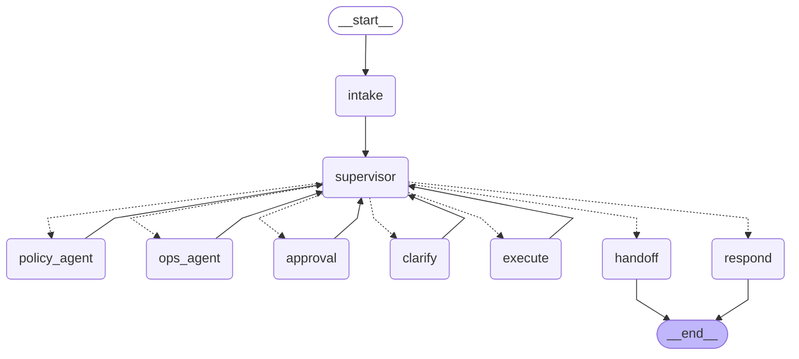

# The agent graph

Generated from the compiled LangGraph by `scripts/graph_doc.py`; do not edit by hand.
Solid edges are fixed; dotted edges are the supervisor's routing, a plain function of the state.

